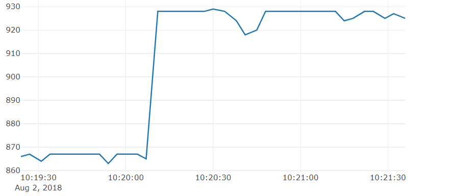

# esp8266webapp

## Description 
**esp8266webapp** is a web app that lively plots the data contained in a **Firebase Realtime Database** node. Plots are made thanks to [plotly.js](https://plot.ly/javascript/) library. To feed the database node, we initially used an **ESP8266** measuring luminosity and a Firebase Cloud Function, hence the name of this web app.

The full stories are on [Medium](https://medium.com/@o.lourme):
* [Part 1](https://medium.com/@o.lourme/our-iot-journey-through-esp8266-firebase-angular-and-plotly-js-part-1-a07db495ac5f) - An **ESP8266** pushes luminosity measures to a **Firebase Realtime Database**.
* [Part 2](https://medium.com/@o.lourme/our-iot-journey-through-esp8266-firebase-angular-and-plotly-js-part-2-14b0609d3f5e) - A **Firebase Cloud Function** appends a timestamp to each value pushed to a Firebase Realtime Database.
* [Part 3](https://medium.com/@o.lourme/our-iot-journey-through-esp8266-firebase-angular-and-plotly-js-part-3-644048e90ca4) - A web app **susbscribes** to the data stream coming from a Firebase Realtime Database and plot it. This is the purpose of this repo. 

## Getting started
Reading [Part 3](https://medium.com/@o.lourme/our-iot-journey-through-esp8266-firebase-angular-and-plotly-js-part-3-644048e90ca4), you will have details on how to:
* Clone or download this repo in your development folder.
* Replace the first lines of `script.js` with your own **Firebase Project Configuration**.
* Run the app with **Firebase development server** during development, then host it with **Firebase Hosting**.

## Demo
See the real live plot of [my veranda luminosity](https://esp8266-rocks.firebaseapp.com/) (one measure every 5 minutes) :smiley:
## Acknowledgments

* [https://angularfirebase.com/lessons/realtime-charts-with-plot-ly/](https://angularfirebase.com/lessons/realtime-charts-with-plot-ly/)
